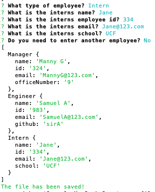

# Team Profile 

[](https://github.com/siryaw/team-profile-)

## Description

This is a Node CLI application that takes in user provided information on different employee types. Based on the information provided, the app writes the output to an HTML file. It uses the Inquirer package to prompt for questions.


## Table of Contents 

* [Installation](#installation)
* [Usage](#usage)
* [Tests](#tests)
* [License](#license)
* [Contributing](#contributing)

* [Questions](#questions)

## Installation

Run to install the necessary dependecies: 

```
npm i
```

## Tests

Run command for test:

```
undefined
```

## Usage

Clone this repo and run on your terminal.

## License
This project is licensed under the MIT license.
  
## Contributing

Pull Request for contributions.

## Questions


If you have any questions about the repo, open an issue or contact [siryaw](https://api.github.com/users/siryaw) directly at null.
